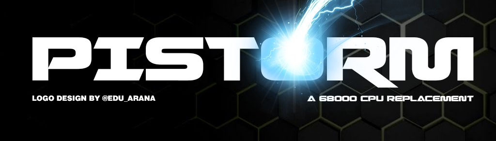

# PiStorm

# Join us on Discord or on Libera Chat IRC #PiStorm

* There's a Discord server dedicated to PiStorm discussion and development, which you can join through this handy invite link: https://discord.com/invite/j6rPtzxaNW
* There are also IRC channels on the Libera IRC network (irc.libera.chat):
  * `#PiStorm`, bridged with the `#general` channel on Discord, `#PiStorm-hardware` which is bridged with `#hardware`, `#PiStorm-firmware`, bridged with `#firmware`,
  * `#PiStorm-Amiga` bridged with `#software-amiga`, `#PiStorm-pi`, brigded with `#software-pi` and `#PiStorm-chat`, bridged with `#ot-and-chitchat`.

* **IMPORTANT NOTE: Selling blank or complete PCBs or derivatives on eBay or elsewhere for excessive profit is frowned upon and may lead to forthcoming related projects being closed source.**
* Even with the current global chip shortage (October 2021), components are not **so** expensive that you should pay up to a hundred dollars or Euros for a board.
* The PiStorm is not a project for making money, it is meant to be an affordable way to replace and extend the functionality of EOL Motorola 68000 processors and have fun in the process.
* This is not meant to discourage you from making PiStorm boards for others to enjoy, but for instance selling the product as a commercial item and then pawning off support to the community if something doesn't work is absolutely not good™.

# Project information

* The PiStorm itself is an adapter board intended to be paired with a Raspberry Pi Model 3A+. It goes in the DIP socket on and acts in place of the CPU, but functionality can be extended beyond simple CPU emulation.
* Hardware files are available in `PiStorm_RevB_EPM240_74LVC16373.zip`, but they may be out of date. Joining the Discord and checking for the latest revision/BoM for the PiStorm adapter board is recommended. Please note that just because it says "RevB_EPM240" does _NOT_ mean that all Rev B boards are EPM240s.
  * ~~Please note that the `EPM240` and `EPM570` used on the PiStorm board must be an Altera **MAX II** CPLD. There are currently some speed grade issues with the newer **MAX V** counterparts that prevent them from functioning as a replacement.~~
  * There is now an experimental bitstream available for the **MAX V** EPM240 part that can be flashed using the `flash.sh` script, but please note that this is not yet thoroughly tested and since not all silicon is created equal and this firmware requires overclocking the CPLD itself, it may not or may not work properly. Testing is currently underway.

* While the PiStorm should work with any DIP socket 16-bit 68000-powered system, the FC lines are currently not properly handled and no guarantees can be made for it working on anything except an Amiga 500, 500+, 1000 and 2000. It does work to some extend in a CDTV, but the lack of bus arbitration signal handling in the CPLD firmware will mean that the CD-ROM drive either does not work at all, or only works sporadically when the timing stars align.
* General Performance with the current use of Musashi as the 68k CPU emulator is somewhere around a 100-125MHz 68030.
* The intended Raspberry Pi model to use with the PiStorm is Model 3A+. 3B+ works, but due to component clearance issues it will not fit unless the Pi itself is modified (USB ports replaced) or a GPIO spacer/relocator is installed.
* **Raspberry Pi Zero2 and Raspberry Pi Model 3a+ work out of the box**, the Raspberry Pi Zero and Model 2/4 **cannot** currently be used with the PiStorm. While support for other Raspberry Pi models is planned with an updated CPLD firmware, there is no ETA for this.
* While the BOM lists an `EPM570T100C5N` as the CPLD that should be used, you can substitute it with for instance an `EPM240T100C5N` or equivalent, but there are some things worth knowing.
  * The **T100** part of the component name is important, as this signifies the number of pins, make sure this is in the part name of the model you substitute the original one with.
  * The number 5 in C**5**N is the speed grade of the CPLD. 5 is slower than 4 or 3, and while 4 works with the current bit stream (June 2, 2021), it cannot be guaranteed to work with upcoming CPLD bit streams, so please stick to speed grade 5 for the time being.
  * The letter C in **C**5N denotes "Consumer" grade CPLD. They are available in "I" and "A" variants as well, denoting "Industrial" and "Automotive". The only difference here is the operating temperature range for the component.
  * The letter N in C5**N** signifies that the device is RoHS compliant. If you do not require an RoHS compliant device for your board, the one with no N can also be used.
  * While the **GT** variant of the EPM240 (for instance `EPM240GT100I5N`) does work, this requires some changes to the components you populate the board with, please inquire on Discord or IRC for detailed information.

# Amiga-specific functionality

Since much of the initial work and testing for the PiStorm was done on Amiga computers, a number of extended features are available when the PiStorm is paired with for instance an Amiga 500:
* Kickstart ROM mapping: 1.3, 2.0, 3.1, anything you might own and have dumped in a byteswapped format. Extended ROM mapping as well for instance with the CDTV extended BIOS.
  * An A1200 3.1+ Kickstart ROM is currently recommended, as this one has the most dynamic automatic configuration on boot.
* Fast RAM: Z2, Z3 and CPU local Fast can be mapped for high performance memory available to the CPU only on the PiStorm side of things.
* Virtual SCSI: PiSCSI, a high performance virtual SCSI interface for mapping raw RDB disk images or physical storage devices connected to the Pi for use on the Amiga.
* RTG: PiGFX, a virtual RTG board with almost all P96-supported functionality supported and accelerated.
* Some other things: Most likely I forgot something while writing this, but someone will probably tell me about it.

# Simple quickstart

* Download Raspberry Pi OS from https://www.raspberrypi.org/software/operating-systems/, the Lite version is recommended as the windowing system of the Full version adds a lot of extra system load which may impact performance. **Note: You must use the 32bit version of Pi OS.** 
* Write the Image to a SD Card. 8GB is plenty for the PiStorm binaries and required libraries, but if you wish to use large hard drive images or sometthing with it, go with a bigger card.
* Install the PiStorm adapter in place of the orignal CPU in the system, for instance an Amiga 500.
  Make sure the PiStorm sits flush and correct in the socket.
  When installed in an Amiga 500, The correct orientation on the PiStorm is with the USB port facing toward you and the HDMI port facing to the right.
  If the PiStorm does not stay in place properly (popping out of the CPU socket) then bend the pins of the PiStorm very very very slightly outwards.
  Double check that all is properly in place and no pins are bent.
* Connect an HDMI Display and a USB keyboard to the PiStorm. Using a USB Hub is possible, an externally powered hub is recommended.
  Connect the Amiga to the PSU and PAL Monitor
* Insert the SD into the Raspberry Pi, Power on the Amiga now. You should see a Rainbow colored screen on the HDMI Monitor and the PiStorm booting.

* When the boot process is finished (on the first run it reboots automatically after resizing the filesystems to your SD) you should be greeted with the login prompt.
* Log in as the default user, typically user: `pi` and password: `raspberry`. (The keyboard is set to US Layout on first boot!)
* Run `sudo raspi-config`
* Set up your preferences like keyboard layout, language, etc. It is recommended to set the screen resolution to 1280x720.
* Set up your Wi-Fi credentials
* Enable SSH at boot time
* Exit raspi-config

You can now reach the PiStorm over SSH, check your router web/settings page to find the IP of the PiStorm, or run `ifconfig` locally on the PiStorm from the console.

Now the final steps to get things up and running, all of this is done from a command prompt (terminal) either locally on the PiStorm or over ssh:
* `sudo apt-get update`
* `sudo apt full-upgrade` (If you get mysterious 'not found' messages from running the line in the next step.)
* `sudo apt-get install git libasound2-dev`
* `git clone https://github.com/captain-amygdala/pistorm.git`
* `cd pistorm`
* `make`

**Important note:** If you are using **Raspberry Pi OS "Bullseye"**, the main graphics backend for the OS has changed from dispmanx to DRM, and you need to follow these steps instead of just running `make`:
* First run `sudo apt-get install libdrm-dev libegl1-mesa-dev libgles2-mesa-dev libgbm-dev` to install the DRM OpenGL/ES libraries, which are for some reason not included with the distro by default. These are necessary to link the graphics output library (raylib).
* Then finally, run `make PLATFORM=PI3_BULLSEYE` for the emulator to compile successfully.

Next up, follow the steps for installing the FPGA bitstream update below. (Scroll down.)

If you are running the PiStorm in an Amiga computer, you can start the emulator with a basic default Amiga config by typing `sudo ./emulator --config amiga.cfg`.  
In addition, the emulator will attempt to load a file called `default.cfg` if no config file is specified on the command line, so if you wish for the emulator to start up with for instance the basic default Amiga config, you can copy `amiga.cfg` to `default.cfg`.  
**Important note:** Try not to edit the sample config files such as `amiga.cfg`, always save them under a different name, for instance one directory level below the `pistorm` directory.  
One way to do this would be to copy for instance `amiga.cfg` like this: `cp ./amiga.cfg ../amiga.cfg` and then running the emulator using `sudo ./emulator --config ../amiga.cfg`. This way, you will never have any problems using `git pull` to update your PiStorm repo to the latest commit.

To exit the emulator you can press `Ctrl+C` (on the keyboard or over SSH) or press `Q` on the keyboard connected to the Raspberry Pi.

For Amiga, there is currently no Gayle or IDE controller emulation available, but PiSCSI can now autoboot RDB/RDSK hard drive images (and physical drives), with Kickstart 2.0 and up. Check out the readme in `platforms/amiga/piscsi` for more detailed information.

# CPLD bitstream update :

Install OpenOCD:
`sudo apt-get install openocd`

Run the CPLD update with `./flash.sh`, this will automatically detect your CPLD version and flash appropriately.

If successful "Flashing successful!" will appear, if not it will fail with "Flashing failed" and `nprog_log.txt` will be created with more details.
